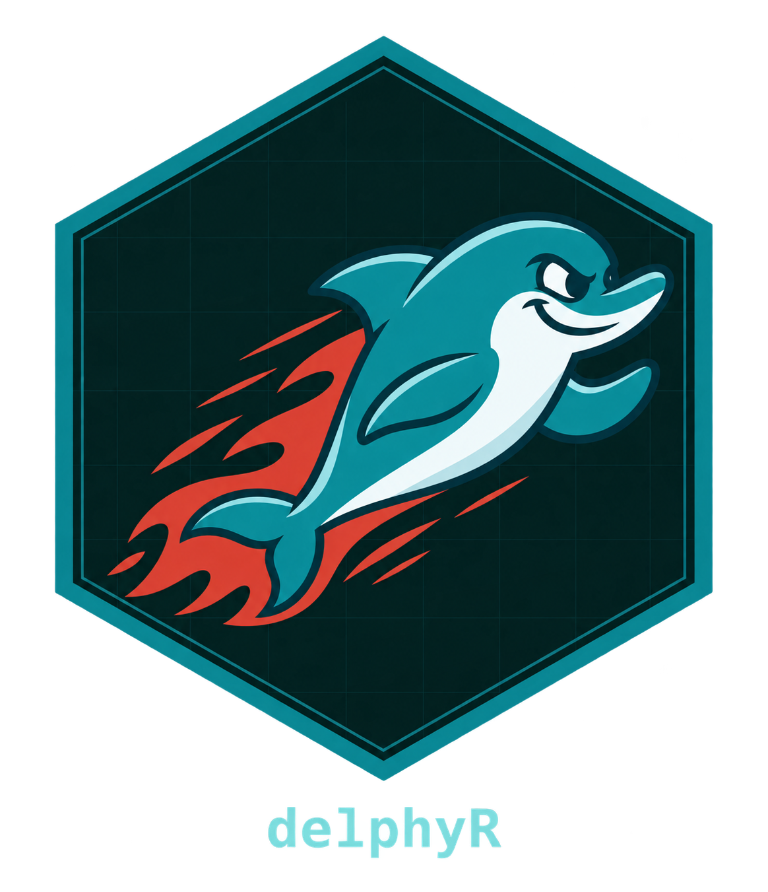

# delphyR 

**A traceable workflow for round-based Delphi studies.**

delphyR combines the independent R package `delphyr`, the multilingual Shiny
workspace `delphyrApp`, and transactional PostgreSQL services. Study teams can
review instruments, collect explicitly submitted ratings, freeze rounds, prepare
feedback, and reproduce the resulting analysis outside the application.
Consensus classification, descriptive change, and human item decisions remain
separate. The interface supports English, German, and French, with English as the default;
package guides are English. Scientific wording retains its authored language.

**Development software, using synthetic data only.** Local checks are not a
production release or scientific validation. The current evidence and remaining
gates are recorded in [implementation status](docs/IMPLEMENTATION_STATUS.md).
This is not a CRAN release.

## Install and analyse

The repository contains two packages. Install the core package for offline
analysis; it needs neither a running Shiny application nor a PostgreSQL server.

```r
# install.packages("remotes")
remotes::install_github("CTTIR/delphyR", subdir = "packages/delphyr",
                        build_vignettes = TRUE)

library(delphyr)
snapshot <- demo_snapshot()
analysis <- analyse_round(snapshot)
analysis$decisions
analysis$denominators
analysis$missingness

feedback <- prepare_feedback(analysis)
validate_feedback(feedback)
```

The example has ten valid ratings: seven in the agreement range, one in the
disagreement range, and two between them. The empty second panel group remains
visible as `insufficient_data`. `demo_snapshot()` explicitly uses a pooled rule;
`demo_protocol()` instead requires adequate results in every designated group.
The demonstration thresholds are examples, not methodological recommendations.

From a local checkout:

```sh
Rscript -e 'remotes::install_deps("packages/delphyr", dependencies = TRUE)'
R CMD INSTALL packages/delphyr
```

The repository is named `delphyR`; the R package is loaded as `delphyr`. Open the
worked guide with `vignette("offline", package = "delphyr")` after installing
with built vignettes. A direct `R CMD INSTALL` of the source directory does not
build its HTML vignette.

## Run the local application

The application demonstration uses synthetic accounts and loopback addresses.
It requires Docker, R, and the dependencies documented in `renv.lock`.
Run these commands from the repository root:

```sh
Rscript scripts/bootstrap.R
docker compose -f deploy/compose.dev.yaml up -d
Rscript scripts/configure-dev-role.R
Rscript scripts/worker.R
```

In separate terminals, start the manager and a synthetic panel session:

```sh
Rscript scripts/start-demo.R manager
Rscript scripts/start-demo.R 1 3850
```

Open <http://127.0.0.1:3849> for the manager and
<http://127.0.0.1:3850> for the first panel account. Review and open the prepared
round as manager. The panel account records consent, saves each response, and
explicitly submits. Close and freeze the round before requesting analysis.
The separate worker processes analysis, exports, and approved local message receipts.

Each demo instance uses one fixed server identity. Session-specific repository
and identity factories are available for trusted hosts; they do not themselves
implement a login system. A local OIDC gateway has separate qualification
[evidence and limits](docs/authentication.md). The stock Shiny Server OSS
identity-header path and production deployment remain unqualified.

## Study workflows

- **Panel:** no preselected rating, explicit saves, revision conflict checks,
  deliberate submission, and a durable receipt. Released feedback includes only
  the participant's own previous responses alongside approved aggregates.
- **Management:** exact instrument review, round transitions, future-round
  protocol amendments, queued analysis and exports, and reviewed feedback releases.
- **Editorial review:** preserved originals, separate redactions or summaries,
  independent review, theme coding, and version-specific item lineage.
- **Coordination:** contact CSV previews with blocking duplicate review and
  unbound invitation drafts; exact campaign previews with local database sink
  receipts. No external email is sent.

Invitation acceptance is a separate service contract using an explicitly
approved, already provisioned issuer/subject identity. Importing an address does
not create an account or grant study access. The full invitation browser journey
remains a separate integration gate.

## Data and reproducibility

Valid ratings form the agreement denominator. Missing responses, abstention, and
inability to judge are reported separately. Quartiles use type 7; consensus rules
use unrounded proportions. Changed item meanings require an explicit
comparability decision.

Private numeric exports contain the frozen snapshot, protocol, analysis,
dictionary, instrument texts, missingness, structured item decisions, and lineage.
They exclude qualitative originals, unreviewed editorial reasons, and account
mappings. Pseudonyms are not anonymous identifiers.

When Quarto is installed, the worker renders a fixed package template. Missing
author information stays explicitly undocumented. An absent optional runtime
selects a labelled basic HTML fallback; an actual render failure fails the job.
The manifest records the renderer and checksums every delivered file.

## Guides and verification

- [Core package](packages/delphyr/README.md) and [offline vignette](packages/delphyr/vignettes/offline.Rmd).
- [Application guide](packages/delphyrApp/README.md) and [browser evidence](packages/delphyrApp/inst/qa/README.md).
- [User guide](docs/user-guide.md), [operations](docs/operations.md), and [reporting](docs/reporting.md).
- [Protocol amendments](docs/protocol-amendments.md), [panel import](docs/panel-import.md),
  [participation](docs/participation.md), and [synthetic communications](docs/communications.md).
- [Authentication](docs/authentication.md), [invitations](docs/invitations.md), and
  the [historical specification index](docs/spec/README.md).

Some detailed implementation documents and the historical specification remain
in German. Current code and verified status take precedence over historical
examples of planned interfaces.

```sh
Rscript scripts/demo-e2e.R
DELPHYR_TEST_DB=true Rscript scripts/integration.R
Rscript scripts/check-packages.R
```

The two-round service demonstration is independent of the interface. Database
tests require explicit opt-in and create only synthetic fixtures. Formal
accessibility, the complete browser matrix, institutional approvals, and
production operations remain distinct gates.

## Contributing and license

Use synthetic examples and preserve existing study evidence. `admin/` remains
local and ignored; credentials, real participant data, local libraries, and
private exports must not enter Git. This project is licensed under the
[MIT License](LICENSE), copyright Raban Heller.
