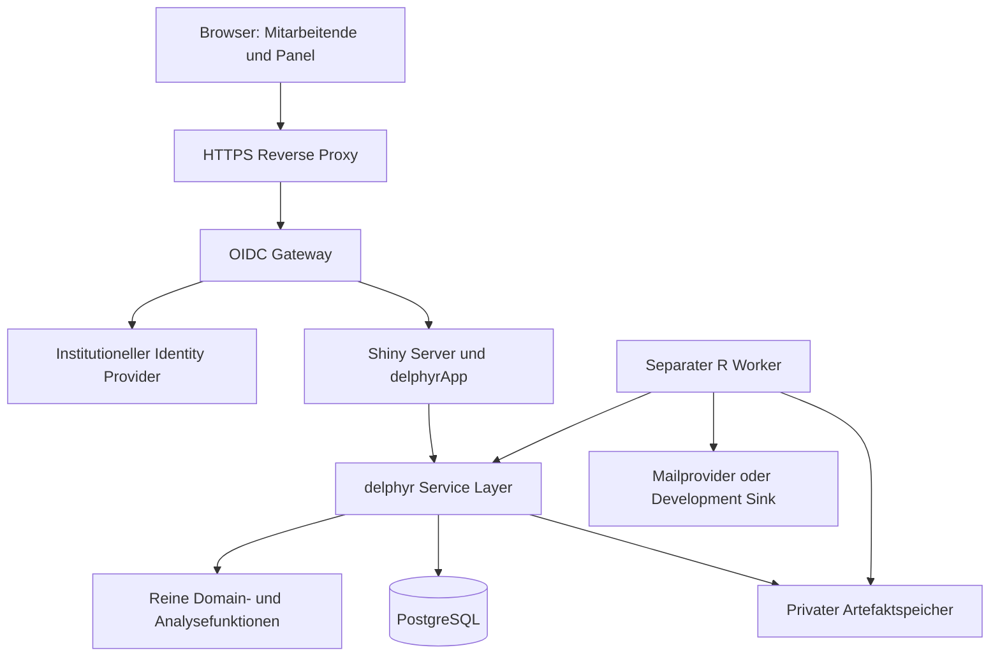

# Systemarchitektur und Vertrauensgrenzen

> delphyR · Spezifikation v1.0 · 24.09.2026 · Entwurf für die Implementierung

## Komponenten

## Logische Schichten

1. **Domain:** validierte Objekte, Regeln, Zustandsübergänge und reine Auswertungen. Keine Shiny-Globals, keine versteckten Datenbankverbindungen, keine aktuelle Uhrzeit als unkontrollierter Input.
2. **Application services:** autorisierte Befehle mit Transaktionsgrenze, Idempotenz und Audit. Eine fachliche Operation entspricht einem Servicebefehl.
3. **Persistence adapters:** parametrisierte SQL-Abfragen, Migrationen, Mapping zwischen Tabellen und Domainobjekten.
4. **Presentation:** Shiny-Module, Formularzustände, Texte und Visualisierung. Keine zweite Implementierung der Konsensregeln.
5. **Background processing:** dauerhafte Jobs für Snapshotberechnung, Berichte und freigegebene Kommunikation.
6. **Infrastructure:** Authentifizierung, HTTPS, Secrets, Datenbank, Backup und Monitoring.

Diese Trennung ist eine logische Architektur. Es werden keine zusätzlichen Microservices benötigt, nur weil mehrere Schichten existieren. Ein REST-API-Dienst ist für P1 nicht erforderlich. Externe Authentifizierung bleibt unabhängig, damit Login und Cookies nicht als Eigenentwicklung in R entstehen.

## Datenflüsse

**Bewertung:** Browserinput → Modulvalidierung für unmittelbares Feedback → Serviceautorisierung und verbindliche Validierung → Transaktion → neue Antwortrevision + aktueller Stand + Audit → Commit → Speicherbestätigung mit Revision.

**Rundenabschluss:** autorisierter Befehl → konsistente Sperrstrategie → `open` zu `closed` → festgelegte Menge zulässiger Abgaben → Snapshotjob. Nach Abschluss keine neuen Antworten in diesen Datenstand aufnehmen.

**Analyse:** unveränderlicher Antwortsnapshot + Regeln + Item-/Skalenversionen → reine Analysefunktionen → Ergebnisse mit Provenienz → Freigabe. Eine neue Berechnung erzeugt ein neues Analyseobjekt.

**Feedback:** freigegebene Analyse + redigierte qualitative Inhalte + Sichtbarkeitspolicy → aggregierter Feedbackstand. Personalisierte Ansichten ergänzen ausschließlich die eigene Vorantwort. Speicherung von Anzeigeereignissen dokumentiert Auslieferung, nicht nachgewiesenes Lesen.

**Export:** autorisierter Auftrag → Worker liest erlaubten Snapshot → schreibt privates Artefakt → registriert Prüfsumme und Ablauf → Downloadendpunkt prüft erneute Berechtigung.

## Architektur-Invarianten

- Datenbank ist die maßgebliche Quelle für bestätigte Antworten und Prozesszustände.
- In-Memory-Reaktivität ist eine Ansicht; sie ist kein dauerhafter Speicher.
- Alle IDs werden serverseitig auf Studienzugehörigkeit geprüft.
- Ein Analyseergebnis referenziert genau einen Antwortsnapshot und eine Regelversion.
- Eine Runde referenziert genau die freigegebenen Instrumentversionen und die vorgesehenen Feedbackstände.
- Jobs verändern wissenschaftliche Entscheidungen nicht eigenständig.
- Keine rohen Clientwerte werden als SQL, R-Code, Dateipfad oder HTML ausgeführt.
- Zugangsdaten und personenbezogene Inhalte gehören nicht in Git oder Package-Daten.

## Synchronisation

Ein DB-Pool ist pro R-Prozess verwaltbar; Sessionkontext ist pro Shiny-Sitzung. Keine globalen `reactiveValues` für Panelantworten. Bei mehreren Prozessen müssen Statusänderungen über DB-Revisionsnummern oder kurze gezielte Polls sichtbar werden. PostgreSQL Notifications sind optional, nicht Voraussetzung für Korrektheit.

Poolsitzungen dürfen keinen alten Sicherheitskontext übernehmen. Ein ausgeliehener Connection-Handle wird innerhalb einer Operation genutzt und sicher zurückgegeben. Für transaktionsgebundenen Kontext `SET LOCAL` bzw. äquivalente parametrisierte Mechanismen prüfen. Niemals eine Verbindung für die gesamte Browserlebensdauer reservieren.

## Erweiterbarkeit

Neue Skalentypen erfordern Validator, Speichervertrag, Rendering, Analysevertrag, Export und Tests. Neue Backendadapter müssen dieselben Integritätsanforderungen erfüllen. SQLite darf für einzelne reine Beispiele dienen, ist aber kein Ersatz für PostgreSQL-Integrationstests oder ein still unterstütztes Produktionsbackend.
