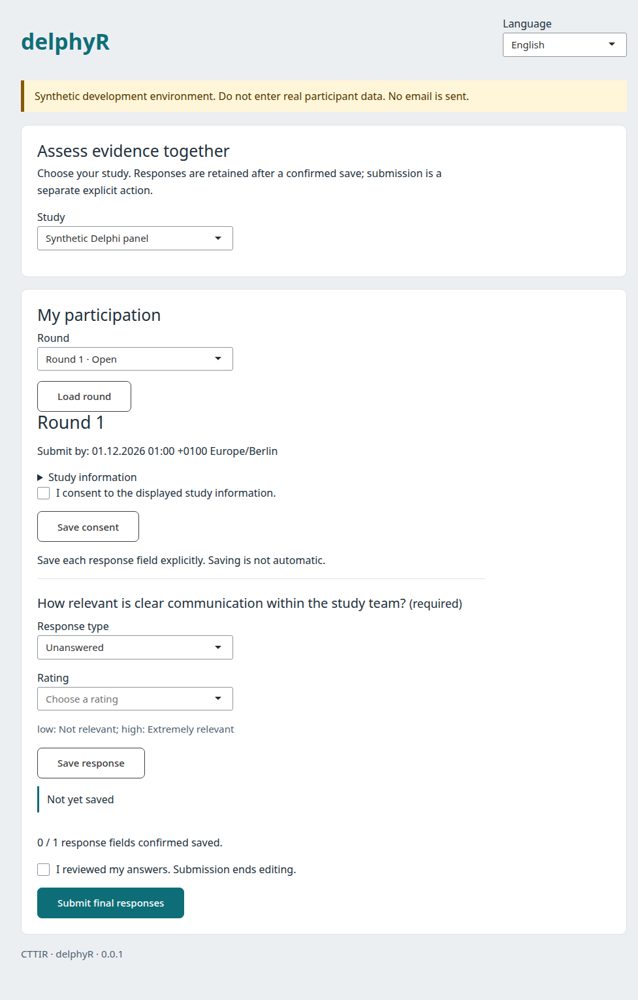

# delphyrApp

A focused, bilingual Shiny workspace for **synthetic Delphi studies** in the
CTTIR suite. Panel members save their own responses and receive a durable
submission receipt. Study managers review and advance rounds through checked
state transitions, queue analysis and exports, review and release exact feedback
candidates, and prepare subsequent rounds from validated bilingual CSV imports.



## Run locally

Install `delphyr` first, then `delphyrApp`. Resolve the repository and actor on
the server; the interface never accepts a browser-supplied identity or role.

```r
# repo and actor are supplied by your trusted server-side setup.
app <- delphyrApp::run_app(repo, actor, language = "en")
shiny::runApp(app, host = "127.0.0.1", port = 3838)
```

This is a synthetic development application. It does not implement production
login, real email delivery, or deployment approval. Keep it bound to localhost.

## Response workflow

1. Choose a study and load an assigned round.
2. Read the displayed study information and explicitly record consent.
3. Select a response type and rating or text. Save each field explicitly.
4. Check the count of confirmed response fields, confirm review, and submit.

A failed save leaves the typed value visible and does not advance its confirmed
revision. Submission is blocked while any field has pending changes. The core
service independently checks consent, ownership, permissions, deadline, required
responses, and the exact revision set. Submitted responses cannot be edited.
There is no default midpoint rating and no live current-round panel result.

## Design and accessibility

Teal, slate, system fonts, restrained surfaces, and 44-pixel buttons follow the
CTTIR `brainwritR` family. Every input has a visible label; status messages use a
polite live region and do not rely on color. Forms fit narrow viewports, tables
can scroll, focus is visible, and reduced motion is respected. German and
English interface text is provided; stored instrument translations are used
without automatically translating scientific content. Panel labels follow the selected language; updates preserve unsaved controls.
Deadlines show the protocol time zone and explicit UTC offset.

Formal assistive-technology, cross-browser, and mobile acceptance remains open.
This version deliberately uses explicit saves. Debounced autosave, offline
recovery and full instrument editing remain acceptance work. Managers can
inspect immutable protocol versions, validate a complete JSON amendment, review
its field changes, and approve it explicitly for future rounds only.
Editorial modules preserve originals, save separate redactions or summaries,
require another person to review exact versions, and record theme coding and
item provenance. Communication campaigns preview exact pseudonyms and plain
text before approval for local test receipts; no email transport is enabled. Released feedback is displayed beside
relevant items, with own prior responses and a changed-wording notice.

## Architecture and verification

Namespaced Shiny modules call injected services; they contain no SQL and no
consensus formulas. `golem` is not required: a small package with explicit
service injection and `testServer()` provides the needed P0 separation without
an additional framework. A fixed `repo` connection belongs to the calling host. For multiple users,
`actor_factory(session, repo)` resolves the trusted identity once per session,
and `repo_factory()` can create a separate repository connection for each
session; the application closes these factory-created connections when the
session ends. A single shared demo actor is not multi-user authentication.
Factory errors or missing identities close the session before service access.

```r
testthat::test_local("packages/delphyrApp")
```

Tests exercise failed-save preservation, revision advancement only after service
success, and the absence of the trusted principal from delivered HTML.

Analysis and export operations are processed by a separate trusted worker.
Use **Check operation** to refresh queue status. Downloads recheck artifact
permissions before packaging the authorized export directory. Feedback release
requires a preview and confirmation of the exact candidate hash.

Editorial access requires the edit capability; independent review requires
manage. Communication controls require coordinate. These interface rules are
rechecked in the core services. See [qualification evidence](inst/qa/README.md)
for local PostgreSQL browser paths and remaining verification boundaries.

The navigation links reflect the selected study's permissions and preserve
open forms when moving between sections. Coordinators can preview synthetic
contact CSVs, resolve blocking duplicates, and approve an exact file to create
unbound invitation drafts. This import creates no accounts or response links.
